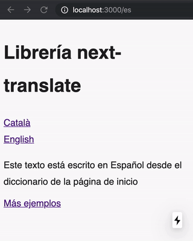
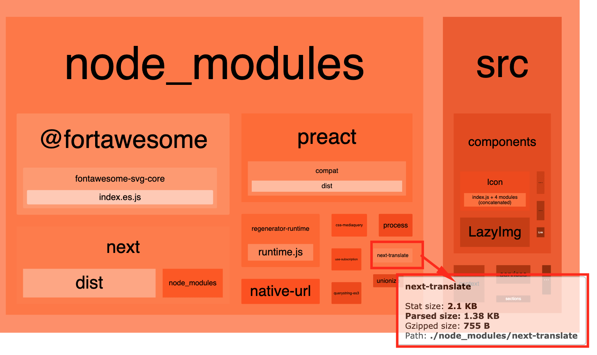

<p align="center">
    
</p>

<p align="center">
    Easy <b>i18n</b> for Next.js +10
</p>
<p align="center">
    <b>Next plugin</b> + <b>i18n API</b>
</p>

<div align="center">

[](https://badge.fury.io/js/next-translate)
[![PRs Welcome][badge-prwelcome]][prwelcome]
<a href="https://github.com/vinissimus/next-translate/actions?query=workflow%3ACI" alt="Tests status">
</a>
<a href="https://twitter.com/intent/follow?screen_name=shields_io">
</a>

</div>

- [1. About next-translate](#1-about-next-translate)
  - [How are translations loaded?](#how-are-translations-loaded)
- [2. Getting started](#2-getting-started)
  - [Install](#install)
  - [Add next-translate plugin](#add-next-translate-plugin)
  - [Add i18n.js config file](#add-i18njs-config-file)
  - [Create your namespaces files](#create-your-namespaces-files)
  - [Use translations in your pages](#use-translations-in-your-pages)
- [3. Configuration](#3-configuration)
- [4. API](#4-api)
  - [useTranslation](#usetranslation)
  - [withTranslation](#withtranslation)
  - [Trans Component](#trans-component)
  - [DynamicNamespaces](#dynamicnamespaces)
  - [getT](#gett)
  - [I18nProvider](#i18nprovider)
  - [appWithI18n](#appwithi18n)
  - [loadNamespaces](#loadnamespaces)
- [5. Plurals](#5-plurals)
- [6. Use HTML inside the translation](#6-use-html-inside-the-translation)
- [7. Nested translations](#7-nested-translations)
- [8. Fallbacks](#8-fallbacks)
- [9. How to change the language](#9-how-to-change-the-language)
- [10. How to save the user-defined language](#10-how-to-save-the-user-defined-language)
- [11. How to use multi-language in a page](#11-how-to-use-multi-language-in-a-page)
- [12. How to use next-translate in a mono-repo](#12-how-to-use-next-translate-in-a-mono-repo)
- [13. Demos](#13-demos)
  - [Demo from Next.js](#demo-from-nextjs)
  - [Basic demo](#basic-demo)
  - [Complex demo](#complex-demo)
  - [Without the webpack loader demo](#without-the-webpack-loader-demo)
- [Contributors ✨](#contributors-)

<p align="center">
    
</p>

## 1. About next-translate

The main goal of this library is to keep the translations as simple as possible in a Next.js environment.

Next-translate has two parts: **Next.js plugin** + **i18n API**.

**Features** ✨

- 🚀  ・ Works well with automatic page optimization.
- 🦄  ・ Easy to use and configure.
- 🌍  ・ Basic i18n support: interpolation, plurals, useTranslation hook, Trans component...
- 🈂️  ・ It loads only the necessary translations _(for page and for locale)_.
- 📦  ・ Tiny (~1kb) and tree shakable. No dependencies.

<p align="center">
    
</p>

### How are translations loaded?

In the configuration file, you specify each page that namespaces needs:

**i18n.json**

```js
{
  "pages": {
    "*": ["common"],
    "/": ["home"],
    "/cart": ["cart"],
    "/content/[slug]": ["content"],
    "rgx:^/account": ["account"]
  }
  // rest of config here...
}
```

_[Read here](#create-your-namespaces-files) about how to add the namespaces JSON files._

Next-translate ensures that each page only has its namespaces with the current language. So if we have 100 locales, only 1 will be loaded.

In order to do this we use a **webpack loader** that loads the necessary translation files inside the Next.js methods (**getStaticProps**, **getServerSideProps** or **getInitialProps**). If you have one of these methods already on your page, the webpack loader will use your own method, but the defaults it will use are:

- **`getStaticProps`**. This is the **default method used on most pages**, unless it is a page specified in the next two points. This is for performance, so the calculations are done in build time instead of request time.
- **`getServerSideProps`**. This is the **default method for dynamic pages** like `[slug].js` or `[...catchall].js`. This is because for these pages it is necessary to define the `getStaticPaths` and there is no knowledge of how the slugs should be for each locale. Likewise, how is it by default, only that you write the getStaticPaths then it will already use the getStaticProps to load the translations.
- **`getInitialProps`**. This is the **default method for these pages that use a HoC**. This is in order to avoid conflicts because HoC could overwrite a `getInitialProps`.

This **whole process is transparent**, so in your pages you can directly consume the `useTranslate` hook to use the namespaces, and you don't need to do anything else.

If for some reason you use a `getInitialProps` in your `_app.js` file, then the translations will only be loaded into your `getInitialProps` from `_app.js`. We recommend that for optimization reasons you don't use this approach unless it is absolutely necessary.

## 2. Getting started

### Install

- `yarn add next-translate`

### Add next-translate plugin

In your **next.config.js** file:

```js
const nextTranslate = require('next-translate')

module.exports = nextTranslate()
```

### Add i18n.js config file

Add a configuration file `i18n.json` _(or `i18n.js` with `module.exports`)_ in the root of the project. Each page should have its namespaces. Take a look at it in the [config](#3-configuration) section for more details.

```json
{
  "locales": ["en", "ca", "es"],
  "defaultLocale": "en",
  "pages": {
    "*": ["common"],
    "/": ["home", "example"],
    "/about": ["about"]
  }
}
```
In the configuration file you can use both the configuration that we [specified here](#3-configuration) and the own [features about internationalization of Next.js 10](https://nextjs.org/docs/advanced-features/i18n-routing).


### Create your namespaces files

By default the namespaces are specified on the **/locales** root directory in this way:

**/locales**

```bash
.
├── ca
│   ├── common.json
│   └── home.json
├── en
│   ├── common.json
│   └── home.json
└── es
    ├── common.json
    └── home.json
```

Each filename matches the namespace specified on the `pages` config property, while each file content should be similar to this:

```json
{
  "title": "Hello world",
  "variable-example": "Using a variable {{count}}"
}
```

However, you can use another destination to save your namespaces files using [loadLocaleFrom](#3-configuration) configuration property:

**i18n.js**

```js
{
  // ...rest of config
  "loadLocaleFrom": (lang, ns) =>
    // You can use a dynamic import, fetch, whatever. You should
    // return a Promise with the JSON file.
    import(`./myTranslationsFiles/${lang}/${ns}.json`).then((m) => m.default),
}
```

### Use translations in your pages

Then, use the translations in the page and its components:

**pages/example.js**

```jsx
import useTranslation from 'next-translate/useTranslation'

export default function ExamplePage() {
  const { t, lang } = useTranslation('common')
  const example = t('variable-example', { count: 42 })

  return <div>{example}</div> // <div>Using a variable 42</div>
}
```

You can consume the translations directly on your pages, you don't have to worry about loading the namespaces files manually on each page. The [next-translate plugin](#add-next-translate-plugin) loads only the namespaces that the page needs and only with the current language.

## 3. Configuration

In the configuration file you can use both the configuration that we specified here and the own [features about internationalization of Next.js 10](https://nextjs.org/docs/advanced-features/i18n-routing).

| Option            | Description                                                                                                                                                                                                                                                                                                                                                                                                                                                                                                                                                                                            | Type                            | Default                                                                         |
| ----------------- | ------------------------------------------------------------------------------------------------------------------------------------------------------------------------------------------------------------------------------------------------------------------------------------------------------------------------------------------------------------------------------------------------------------------------------------------------------------------------------------------------------------------------------------------------------------------------------------------------------ | ------------------------------- | ------------------------------------------------------------------------------- |
| `defaultLocale`   | ISO of the default locale ("en" as default).                                                                                                                                                                                                                                                                                                                                                                                                                                                                                                                                                           | `string`                        | `"en"`                                                                          |
| `locales`         | An array with all the languages to use in the project.                                                                                                                                                                                                                                                                                                                                                                                                                                                                                                                                                 | `string[]`                 | `[]`                                                                       |  
| `loadLocaleFrom`  | Change the way you load the namespaces.                                                                                                                                                                                                                                                                                                                                                                                                                        | `function` that returns a `Promise` with the `JSON`.                      | By default is loading the namespaces from **locales** root directory.                                                                          |
| `pages`           | An object that defines the namespaces used in each page. Example of object: `{"/": ["home", "example"]}`. To add namespaces to all pages you should use the key `"*"`, ex: `{"*": ["common"]}`. It's also possible to use regex using `rgx:` on front: `{"rgx:/form$": ["form"]}`. You can also use a function instead of an array, to provide some namespaces depending on some rules, ex: `{ "/": ({ req, query }) => query.type === 'example' ? ['example'] : []}` | `Object<string[] or function>` | `{}`                                                       |
| `logger`          | Function to log the **missing keys** in development and production. If you are using `i18n.json` as config file you should change it to `i18n.js`.                                                                                                                                                                                                                                                                                                                                                                                                                                                     | `function`                      | By default the logger is a function doing a `console.warn` only in development. |     |
| `logBuild`        | Each page has a log indicating: namespaces, current language and method used to load the namespaces. With this you can disable it.                                                                                                                                                                                                                                                                                                                                                                                                                                                                                                                    | `Boolean`                       | `true`                                                                          |
| `loader`        | If you wish to disable the webpack loader and manually load the namespaces on each page, we give you the opportunity to do so by disabling this option.                                                                                                                                                                                                                                                                                                                                                                                                                                                                                                                 | `Boolean`                       | `true`                                                                          |
| `interpolation`   | Change the delimeter that is used for interpolation.                                                                                                                                                                                                                                                                                                                                                                                                                                                                                                                                                   | `{prefix: string; suffix: string}` | `{prefix: '{{', suffix: '}}'}`

## 4. API

### useTranslation

**Size**: ~150b 📦

This hook is the recommended way to use translations in your pages / components.

- **Input**: string - defaultNamespace (optional)
- **Output**: Object { t: Function, lang: string }

Example:

```jsx
import React from 'react'
import useTranslation from 'next-translate/useTranslation'

export default function Description() {
  const { t, lang } = useTranslation('ns1') // default namespace (optional)
  const title = t('title')
  const titleFromOtherNamespace = t('ns2:title')
  const description = t`description` // also works as template string
  const example = t('ns2:example', { count: 3 }) // and with query params

  return (
    <>
      <h1>{title}</h1>
      <p>{description}</p>
      <p>{example}</p>
    <>
  )
}
```

The `t` function:

- **Input**:
  - **i18nKey**: string (namespace:key)
  - **query**: Object _(optional)_ (example: { name: 'Leonard' })
  - **options**: Object _(optional)_
    - **fallback**: string | string[] - fallback if i18nKey doesn't exist. [See more](#8-fallbacks).
    - **returnObjects**: boolean - Get part of the JSON with all the translations. [See more](#7-nested-translations).
- **Output**: string

### withTranslation

**Size**: ~560b 📦

It's an alternative to `useTranslation` hook, but in a HOC for these components that are no-functional. _(Not recommended, it's better to use the `useTranslation` hook.)_.

The `withTranslation` HOC returns a Component with an extra prop named `i18n` (Object { t: Function, lang: string }).

Example:

```jsx
import React from 'react'
import withTranslation from 'next-translate/withTranslation'

class Description extends React.Component {
  render() {
    const { t, lang } = this.props.i18n
    const description = t('common:description')

    return <p>{description}</p>
  }
}

export default withTranslation(NoFunctionalComponent)
```

### Trans Component

**Size**: ~1.4kb 📦

Sometimes we need to do some translations with HTML inside the text (bolds, links, etc), the `Trans` component is exactly what you need for this. We recommend to use this component only in this case, for other cases we highly recommend the usage of `useTranslation` hook instead.

Example:

```jsx
// The defined dictionary enter is like:
// "example": "<0>The number is <1>{{count}}</1></0>",
<Trans
  i18nKey="common:example"
  components={[<Component />, <b className="red" />]}
  values={{ count: 42 }}
/>
```

Or using `components` prop as a object:

```jsx
// The defined dictionary enter is like:
// "example": "<component>The number is <b>{{count}}</b></component>",
<Trans
  i18nKey="common:example"
  components={{
    component: <Component />,
    b: <b className="red" />,
  }}
  values={{ count: 42 }}
/>
```

- **Props**:
  - `i18nKey` - string - key of i18n entry (namespace:key)
  - `components` - Array<Node> | Object<Node> - In case of Array each index corresponds to the defined tag `<0>`/`<1>`. In case of object each key corresponds to the defined tag `<example>`.
  - `values` - Object - query params
  - `fallback` - string | string[] - Optional. Fallback i18nKey if the i18nKey doesn't match.

### DynamicNamespaces

**Size**: ~1.5kb 📦

The `DynamicNamespaces` component is useful to load dynamic namespaces, for example, in modals.

Example:

```jsx
import React from 'react'
import Trans from 'next-translate/Trans'
import DynamicNamespaces from 'next-translate/DynamicNamespaces'

export default function ExampleWithDynamicNamespace() {
  return (
    <DynamicNamespaces namespaces={['dynamic']} fallback="Loading...">
      {/* ALSO IS POSSIBLE TO USE NAMESPACES FROM THE PAGE */}
      <h1>
        <Trans i18nKey="common:title" />
      </h1>

      {/* USING DYNAMIC NAMESPACE */}
      <Trans i18nKey="dynamic:example-of-dynamic-translation" />
    </DynamicNamespaces>
  )
}
```

Remember that `['dynamic']` namespace should **not** be listed on `pages` configuration:

```js
 pages: {
    '/my-page': ['common'], // only common namespace
  }
```

- **Props**:
  - `namespaces` - string[] - list of dynamic namespaces to download - **Required**.
  - `fallback`- ReactNode - Fallback to display meanwhile the namespaces are loading. - **Optional**.
  - `dynamic` - function - By default it uses the [loadLocaleFrom](#3-configuration) in the configuration to load the namespaces, but you can specify another destination. - **Optional**.

### getT

**Size**: ~1.3kb 📦

Asynchronous function to load the `t` function outside components / pages. It works on both server-side and client-side.

Unlike the useTranslation hook, we can use here any namespace, it doesn't have to be a namespace defined in the "pages" configuration. It downloads the namespace indicated as a parameter on runtime.

Example inside `getStaticProps`:

```js
import getT from 'next-translate/getT'
// ...
export async function getStaticProps({ locale }) {
  const t = await getT(locale, 'common')
  const title = t('title')
  return { props: { title } }
}
```

Example inside API Route:

```js
import getT from 'next-translate/getT'

export default async function handler(req, res) {
  const t = await getT(req.query.__nextLocale, 'common')
  const title = t('title')

  res.statusCode = 200
  res.setHeader('Content-Type', 'application/json')
  res.end(JSON.stringify({ title }))
}
```

### I18nProvider

**Size**: ~3kb 📦

The `I18nProvider` is a context provider internally used by next-translate to provide the current **lang** and the page **namespaces**. **SO MAYBE YOU'LL NEVER NEED THIS**.

However, it's exposed to the API because it can be useful in some cases. For example, to use multi-language translations in a page.

The `I18nProvider` is accumulating the namespaces, so you can rename the new ones in order to keep the old ones.

```jsx
import React from 'react'
import I18nProvider from 'next-translate/I18nProvider'
import useTranslation from 'next-translate/useTranslation'

// Import English common.json
import commonEN from '../../locales/en/common.json'

function PageContent() {
  const { t, lang } = useTranslation()

  console.log(lang) // -> current language

  return (
    <div>
      <p>{t('common:example') /* Current language */}</p>
      <p>{t('commonEN:example') /* Force English */}</p>
    </div>
  )
}

export default function Page() {
  const { lang } = useTranslation()

  return (
    <I18nProvider lang={lang} namespaces={{ commonEN }}>
      <PageContent />
    </I18nProvider>
  )
}
```

### appWithI18n

**Size**: ~3.7kb 📦

The `appWithI18n` is internally used by next-translate. **SO MAYBE YOU'LL NEVER NEED THIS**. However, we expose it in the API in case you disable the webpack [loader](#3-configuration) option and decide to load the namespaces manually.

If you wish not to use the webpack loader, then you should put this in your `_app.js` file (and create the `_app.js` file if you don't have it).

Example:

`_app.js`

```jsx
import appWithI18n from 'next-translate/appWithI18n'
import i18nConfig from '../i18n'

function MyApp({ Component, pageProps }) {
  return <Component {...pageProps} />
}

// Wraping your _app.js
export default appWithI18n(MyApp, {
  ...i18nConfig,
  // Set to false if you want to load all the namespaces on _app.js getInitialProps
  skipInitialProps: true, 
})
```

If `skipInitialProps=true`, then you should also use the [loadNamespaces](#loadnamespaces) helper to manually load the namespaces on each page.


### loadNamespaces

**Size**: ~1.9kb 📦

The `loadNamespaces` is internally used by next-translate. **SO MAYBE YOU'LL NEVER NEED THIS**. However, we expose it in the API in case you disable the webpack [loader](#3-configuration) option and decide to load the namespaces manually.

To load the namespaces, you must return in your pages the props that the helper provides.

```js
import loadNamespaces from 'next-translate/loadNamespaces'

export function getStaticProps({ locale }) {
  return {
    props: {
      ...(await loadNamespaces({ locale, pathname: '/about' })),
    }
  }
}
```
🚨 To work well, it is necessary that your `_app.js` will be wrapped with the [appWithI18n](#appwithi18n). Also, the `loadLocaleFrom` configuration property is **mandatory** to define it.

## 5. Plurals

We support 6 plural forms (taken from [CLDR Plurals](http://cldr.unicode.org/index/cldr-spec/plural-rules) page) by adding to the key this suffix (or nesting it under the key with no `_` prefix):

- `_zero`
- `_one` (singular)
- `_two` (dual)
- `_few` (paucal)
- `_many` (also used for fractions if they have a separate class)
- `_other` (required—general plural form—also used if the language only has a single form)

_See more info about plurals [here](https://unicode-org.github.io/cldr-staging/charts/37/supplemental/language_plural_rules.html#sl)_.

Only the last one, **`_other`**, is required because it’s the only common plural form used in all locales.

All other plural forms depends on locale. For example English has only two: `_one` and `_other` (1 cat vs. 2 cats). Some languages have more, like Russian and Arabic.

In addition, we also support **an exact match** by specifying the number (`_0`, `_999`) and this works for all locales. Here is an example:

<small>Code:</small>

```js
// **Note**: Only works if the name of the variable is {{count}}.
t('cart-message', { count })
```

<small>Namespace:</small>

```js
{
  "cart-message_0": "The cart is empty", // when count === 0
  "cart-message_one": "The cart has only {{count}} product", // singular
  "cart-message_other": "The cart has {{count}} products", // plural
  "cart-message_999": "The cart is full", // when count === 999
}
```

or

```js
{
  "cart-message": {
     "0": "The cart is empty", // when count === 0
     "one": "The cart has only {{count}} product", // singular
     "other": "The cart has {{count}} products", // plural
     "999": "The cart is full", // when count === 999
  } 
}
```


## 6. Use HTML inside the translation

You can define HTML inside the translation this way:

```json
{
  "example-with-html": "<0>This is an example <1>using HTML</1> inside the translation</0>"
}
```

Example:

```jsx
import Trans from 'next-translate/Trans'
// ...
const Component = (props) => <p {...props} />
// ...
<Trans
  i18nKey="namespace:example-with-html"
  components={[<Component />, <b className="red" />]}
/>
```

Rendered result:

```html
<p>This is an example <b class="red">using HTML</b> inside the translation</p>
```

Each index of `components` array corresponds with `<index></index>` of the definition.

In the `components` array, it's not necessary to pass the children of each element. Children will be calculated.

## 7. Nested translations

In the namespace, it's possible to define nested keys like this:

```json
{
  "nested-example": {
    "very-nested": {
      "nested": "Nested example!"
    }
  }
}
```

In order to use it, you should use "." as id separator:

```js
t`namespace:nested-example.very-nested.nested`
```

Also is possible to use as array:

```json
{
  "array-example": [
    { "example": "Example {{count}}" },
    { "another-example": "Another example {{count}}" }
  ]
}
```

And get all the array translations with the option `returnObjects`:

```js
t('namespace:array-example', { count: 1 }, { returnObjects: true })
/*
[
  { "example": "Example 1" },
  { "another-example": "Another example 1" }
]
*/
```

### 8. Fallbacks

If no translation exists you can define fallbacks (`string|string[]`) to search for other translations:

```js
const { t } = useTranslation()
const textOrFallback = t(
  'ns:text',
  { count: 1 },
  {
    fallback: 'ns:fallback',
  }
)
```

List of fallbacks:

```js
const { t } = useTranslation()
const textOrFallback = t(
  'ns:text',
  { count: 42 },
  {
    fallback: ['ns:fallback1', 'ns:fallbac2'],
  }
)
```

In Trans Component:

```jsx
<Trans
  i18nKey="ns:example"
  components={[<Component />, <b className="red" />]}
  values={{ count: 42 }}
  fallback={['ns:fallback1', 'ns:fallback2']} // or string with just 1 fallback
/>
```

## 9. How to change the language

In order to change the current language you can use the [Next.js navigation](https://nextjs.org/docs/advanced-features/i18n-routing) (Link and Router) passing the `locale` prop.

An example of a possible `ChangeLanguage` component:

```js
import React from 'react'
import Link from 'next/link'
import useTranslation from 'next-translate/useTranslation'
import i18nConfig from '../i18n.json'

const { locales } = i18nConfig

function ChangeLanguage() {
  const { t, lang } = useTranslation()

  return locales.map((lng) => {
    if (lng === lang) return null

    // Or you can attach the current pathname at the end
    // to keep the same page
    return (
      <Link href="/" locale={lng} key={lng}>
        {t(`layout:language-name-${lng}`)}
      </Link>
    )
  })
}
```

## 10. How to save the user-defined language

You can set a cookie named `NEXT_LOCALE` with the user-defined language as value, this way a locale can be forced.

## 11. How to use multi-language in a page

In some cases, when the page is in the current language, you may want to do some exceptions displaying some text in another language.

In this case, you can achieve this by using the `I18nProvider`.

Learn how to do it [here](#i18nprovider).

## 12. How to use next-translate in a mono-repo

Next-translate uses by default the current working directory of the Node.js process (`process.cwd()`). If you want to change it you can use the `NEXT_TRANSLATE_PATH` environment variable. It supports both relative and absolute path.

## 13. Demos

### Demo from Next.js

There is a demo of `next-translate` on the Next.js repo:

- https://github.com/vercel/next.js/tree/master/examples/with-next-translate

To use it:

```bash
npx create-next-app --example with-next-translate with-next-translate-app
# or
yarn create next-app --example with-next-translate with-next-translate-app
```

### Basic demo

This demo is in this repository:

- `git clone git@github.com:vinissimus/next-translate.git`
- `cd next-translate`
- `yarn && yarn example:basic`

### Complex demo

Similar than the basic demo but with some extras: TypeScript, Webpack 5, MDX, with _app.js on top, pages located on src/pages folder, loading locales from src/translations with a different structure.

This demo is in this repository:

- `git clone git@github.com:vinissimus/next-translate.git`
- `cd next-translate`
- `yarn && yarn example:complex`

### Without the webpack loader demo

Similar than the basic example but loading the page namespaces manually deactivating the webpack loader in the i18n.json config file.

> We do not recommend that it be used in this way. However we give the opportunity for anyone to do so if they are not comfortable with our webpack loader.

This demo is in this repository:

- `git clone git@github.com:vinissimus/next-translate.git`
- `cd next-translate`
- `yarn && yarn example:without-loader`

[badge-prwelcome]: https://img.shields.io/badge/PRs-welcome-brightgreen.svg?style=flat-square
[prwelcome]: http://makeapullrequest.com
[spectrum]: https://spectrum.chat/next-translate

## Contributors ✨

Thanks goes to these wonderful people ([emoji key](https://allcontributors.org/docs/en/emoji-key)):

<!-- ALL-CONTRIBUTORS-LIST:START - Do not remove or modify this section -->
<!-- prettier-ignore-start -->
<!-- markdownlint-disable -->
<table>
  <tr>
    <td align="center"><a href="https://aralroca.com"><br /><sub><b>Aral Roca Gomez</b></sub></a><br /><a href="#maintenance-aralroca" title="Maintenance">🚧</a> <a href="https://github.com/vinissimus/next-translate/commits?author=aralroca" title="Code">💻</a></td>
    <td align="center"><a href="https://twitter.com/vincentducorps"><br /><sub><b>Vincent Ducorps</b></sub></a><br /><a href="https://github.com/vinissimus/next-translate/commits?author=vincentducorps" title="Code">💻</a></td>
    <td align="center"><a href="https://www.rahwn.com"><br /><sub><b>Björn Rave</b></sub></a><br /><a href="https://github.com/vinissimus/next-translate/commits?author=BjoernRave" title="Code">💻</a></td>
    <td align="center"><a href="https://github.com/justincy"><br /><sub><b>Justin</b></sub></a><br /><a href="https://github.com/vinissimus/next-translate/commits?author=justincy" title="Code">💻</a></td>
    <td align="center"><a href="https://github.com/psanlorenzo"><br /><sub><b>Pol</b></sub></a><br /><a href="#infra-psanlorenzo" title="Infrastructure (Hosting, Build-Tools, etc)">🚇</a></td>
    <td align="center"><a href="https://twitter.com/ftonato"><br /><sub><b>Ademílson F. Tonato</b></sub></a><br /><a href="https://github.com/vinissimus/next-translate/commits?author=ftonato" title="Code">💻</a></td>
    <td align="center"><a href="https://github.com/Faulik"><br /><sub><b>Faul</b></sub></a><br /><a href="https://github.com/vinissimus/next-translate/commits?author=Faulik" title="Code">💻</a></td>
  </tr>
  <tr>
    <td align="center"><a href="https://github.com/bickmaev5"><br /><sub><b>bickmaev5</b></sub></a><br /><a href="https://github.com/vinissimus/next-translate/commits?author=bickmaev5" title="Code">💻</a></td>
    <td align="center"><a href="https://p.ier.re"><br /><sub><b>Pierre Grimaud</b></sub></a><br /><a href="https://github.com/vinissimus/next-translate/commits?author=pgrimaud" title="Documentation">📖</a></td>
    <td align="center"><a href="https://roman-minchyn.de"><br /><sub><b>Roman Minchyn</b></sub></a><br /><a href="https://github.com/vinissimus/next-translate/commits?author=dnepro" title="Documentation">📖</a> <a href="https://github.com/vinissimus/next-translate/commits?author=dnepro" title="Code">💻</a></td>
    <td align="center"><a href="https://www.egorphilippov.me/"><br /><sub><b>Egor</b></sub></a><br /><a href="https://github.com/vinissimus/next-translate/commits?author=lone-cloud" title="Code">💻</a></td>
    <td align="center"><a href="https://github.com/dhobbs"><br /><sub><b>Darren</b></sub></a><br /><a href="https://github.com/vinissimus/next-translate/commits?author=dhobbs" title="Code">💻</a></td>
    <td align="center"><a href="https://github.com/giovannigiordano"><br /><sub><b>Giovanni Giordano</b></sub></a><br /><a href="https://github.com/vinissimus/next-translate/commits?author=giovannigiordano" title="Code">💻</a></td>
    <td align="center"><a href="https://github.com/kidnapkin"><br /><sub><b>Eugene</b></sub></a><br /><a href="https://github.com/vinissimus/next-translate/commits?author=kidnapkin" title="Code">💻</a></td>
  </tr>
  <tr>
    <td align="center"><a href="https://andrew-c.com"><br /><sub><b>Andrew Chung</b></sub></a><br /><a href="https://github.com/vinissimus/next-translate/commits?author=hibearpanda" title="Code">💻</a></td>
    <td align="center"><a href="http://cuthanh.com"><br /><sub><b>Thanh Minh</b></sub></a><br /><a href="https://github.com/vinissimus/next-translate/commits?author=thanhlmm" title="Code">💻</a></td>
    <td align="center"><a href="https://github.com/croutonn"><br /><sub><b>crouton</b></sub></a><br /><a href="https://github.com/vinissimus/next-translate/commits?author=croutonn" title="Code">💻</a></td>
    <td align="center"><a href="https://github.com/croutonn"><br /><sub><b>crouton</b></sub></a><br /><a href="https://github.com/vinissimus/next-translate/commits?author=croutonn" title="Code">💻</a></td>   
    <td align="center"><a href="http://patrickmuff.ch"><br /><sub><b>Patrick</b></sub></a><br /><a href="https://github.com/vinissimus/next-translate/commits?author=dislick" title="Documentation">📖</a></td>
    <td align="center"><a href="https://github.com/vimutti77"><br /><sub><b>Vantroy</b></sub></a><br /><a href="https://github.com/vinissimus/next-translate/commits?author=vimutti77" title="Code">💻</a></td>
    <td align="center"><a href="https://www.npmjs.com/~farinajoey"><br /><sub><b>Joey</b></sub></a><br /><a href="https://github.com/vinissimus/next-translate/commits?author=josephfarina" title="Code">💻</a></td>
  </tr>
  <tr>
     <td align="center"><a href="https://github.com/gurkerl83"><br /><sub><b>gurkerl83</b></sub></a><br /><a href="https://github.com/vinissimus/next-translate/commits?author=gurkerl83" title="Code">💻</a></td>
  </tr>
</table>

<!-- markdownlint-enable -->
<!-- prettier-ignore-end -->
<!-- ALL-CONTRIBUTORS-LIST:END -->

This project follows the [all-contributors](https://github.com/all-contributors/all-contributors) specification. Contributions of any kind welcome!
